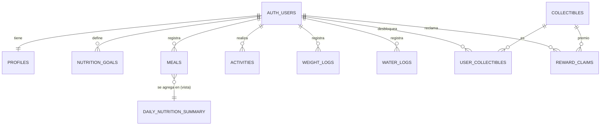

# 🗄️ ÑamÑam — Conexión con Supabase

Esta guía explica cómo conectar las tabs **Historial** (tab2), **Progreso** (tab4) y **Colección** (tab5) con Supabase, y la estructura de base de datos que necesitan.

El SQL completo y listo para ejecutar está en [`schema.sql`](./schema.sql).

---

## 1. Cómo conectar (pasos)

1. Crea un proyecto en [supabase.com](https://supabase.com).
2. Abre **SQL Editor → New query**, pega el contenido de [`schema.sql`](./schema.sql) y ejecútalo. Crea las tablas, la vista, la función de recompensas, las políticas RLS, el bucket de fotos y el catálogo inicial de coleccionables.
3. En **Project Settings → API**, copia la **Project URL** y la **anon public key**.
4. Pégalas en `src/environments/environment.ts` (y en `environment.prod.ts`):

   ```ts
   supabase: {
     url: 'https://<tu-proyecto>.supabase.co',
     anonKey: '<anon-public-key>',
   },
   ```

5. Listo: al detectar las credenciales, la app deja de usar los datos mock y lee todo desde Supabase. No hay que tocar ninguna página.

> [!WARNING]
> **Requisito de autenticación.** Todas las tablas usan Row Level Security (`user_id = auth.uid()`), así que Supabase solo entrega datos si hay una sesión de **Supabase Auth**. Hoy `AuthService` sigue siendo local (`localStorage`), por lo que al activar Supabase las tabs se verán vacías hasta migrar el login a `supabase.auth.signInWithPassword` / `signUp` / `signInWithOAuth`. Esa migración es el siguiente paso pendiente.

> [!NOTE]
> La `anon key` es pública por diseño (la protección la dan las políticas RLS). **Nunca** pongas la `service_role key` en la app.

---

## 2. Arquitectura de la capa de datos

```
 Páginas (tab2 / tab4 / tab5)
        │  solo conocen servicios de negocio
        ▼
 DiaryService · ProgressService · CollectionService · GoalService
        │  calculan agrupaciones, rachas, promedios, progreso gacha
        ▼
 NutritionRepository · CollectionRepository      ← clases abstractas (contratos)
        │
        ├── SupabaseNutritionRepository / SupabaseCollectionRepository   (si hay credenciales)
        └── MockNutritionRepository     / MockCollectionRepository       (si no las hay)
```

- La elección se hace en `src/app/services/data/data.providers.ts` (`provideDataLayer()`, registrado en `main.ts`).
- Los repositorios Supabase **no filtran por `user_id`**: las políticas RLS lo hacen en el servidor.
- Los repositorios convierten `snake_case` (BD) a `camelCase` (modelos en `src/app/models/`).

| Archivo | Responsabilidad |
|---|---|
| `services/supabase.service.ts` | Cliente único de `@supabase/supabase-js` |
| `services/data/nutrition.repository.ts` | Contrato: comidas, resúmenes diarios, metas, peso, agua |
| `services/data/collection.repository.ts` | Contrato: catálogo, desbloqueos, recompensas |
| `services/data/supabase-*.repository.ts` | Implementación contra Supabase |
| `services/data/mock-*.repository.ts` | Datos de demostración locales |
| `services/diary.service.ts` | Agrupa comidas por día para el Historial |
| `services/progress.service.ts` | Barras semanales, días con meta, rachas, peso, agua y macros |
| `services/collection.service.ts` | Álbum y progreso de la recompensa semanal |
| `services/goal.service.ts` | Meta vigente para cada fecha (con respaldo en las métricas del onboarding) |

---

## 3. Qué datos usa cada tab

| Tab | Fuente en Supabase | Qué muestra |
|---|---|---|
| **Historial** (tab2) | `meals`, `nutrition_goals` | Comidas de los últimos 14 días agrupadas por día; consumido vs. meta del día |
| **Progreso** (tab4) | `daily_nutrition_summary`, `nutrition_goals`, `weight_logs`, `water_logs` | Barras L–D, días con meta, racha actual/récord, peso y variación, agua promedio, macros promedio |
| **Colección** (tab5) | `collectibles`, `user_collectibles`, `reward_claims`, `daily_nutrition_summary`, RPC `open_weekly_reward` | Álbum por rareza, % hacia la recompensa, apertura del gacha |
| Inicio (tab1)* | `daily_nutrition_summary`, `nutrition_goals`, `activities` | *Aún con datos fijos; las tablas ya están listas para conectarla* |

---

## 4. Diagrama entidad-relación



---

## 5. Tablas

Todas las tablas por usuario tienen `user_id uuid default auth.uid()`, así que al insertar desde la app **no hace falta enviar `user_id`**.

### `profiles`
Perfil y datos del onboarding. Se crea solo al registrarse (trigger `on_auth_user_created`).

| Columna | Tipo | Notas |
|---|---|---|
| `id` | `uuid` PK | = `auth.users.id` |
| `name` | `text` | |
| `avatar_url` | `text` | |
| `weight_kg`, `height_cm` | `numeric(5,1)` | |
| `age` | `smallint` | |
| `gender` | `text` | `male` \| `female` |
| `activity_level` | `text` | `sedentary` \| `light` \| `moderate` \| `active` |
| `goal` | `text` | `lose` \| `maintain` \| `gain` |
| `has_completed_onboarding` | `boolean` | |
| `created_at` | `timestamptz` | |

### `nutrition_goals`
Historial de metas. Cada fila rige desde `valid_from` hasta la siguiente, así el historial se sigue midiendo contra la meta que había ese día aunque el usuario la cambie.

| Columna | Tipo | Notas |
|---|---|---|
| `id` | `uuid` PK | |
| `user_id` | `uuid` FK | |
| `valid_from` | `date` | único por usuario |
| `target_kcal` | `integer` | meta calórica diaria |
| `protein_g`, `carbs_g`, `fat_g` | `integer` | metas diarias de macros |
| `water_ml` | `integer` | meta diaria de agua (def. 2500) |

> Al terminar el onboarding se debe insertar la primera fila con los valores calculados (Mifflin-St Jeor).

### `meals`
Cada comida registrada (manual o por IA). **Es la fuente de las calorías consumidas**: los totales se calculan, no se guardan.

| Columna | Tipo | Notas |
|---|---|---|
| `id` | `uuid` PK | |
| `user_id` | `uuid` FK | |
| `name` | `text` | ej. "Avena con Frutas" |
| `meal_type` | `text` | `breakfast` \| `lunch` \| `dinner` \| `snack` |
| `consumed_at` | `timestamptz` | fecha y hora exacta |
| `log_date` | `date` | **día local del usuario**, lo calcula la app (evita que la cena caiga en el día siguiente por UTC) |
| `kcal` | `integer` | |
| `protein_g`, `carbs_g`, `fat_g` | `numeric(6,1)` | |
| `photo_path` | `text` | ruta en el bucket `meal-photos` (`<user_id>/<archivo>`) |
| `source` | `text` | `ai` \| `manual` |

### `activities`
Calorías quemadas (para el indicador "Quemadas" de Inicio).

| Columna | Tipo | Notas |
|---|---|---|
| `id` | `uuid` PK | |
| `user_id` | `uuid` FK | |
| `log_date` | `date` | |
| `activity_type` | `text` | ej. "Caminata" |
| `duration_min` | `integer` | |
| `kcal_burned` | `integer` | |
| `source` | `text` | `manual` \| `health_connect` \| `healthkit` |

### `weight_logs`
| Columna | Tipo | Notas |
|---|---|---|
| `id` | `uuid` PK | |
| `user_id` | `uuid` FK | |
| `logged_on` | `date` | único por usuario y día |
| `weight_kg` | `numeric(5,1)` | |

### `water_logs`
Un registro por cada vaso/botella; la app suma por día.

| Columna | Tipo | Notas |
|---|---|---|
| `id` | `uuid` PK | |
| `user_id` | `uuid` FK | |
| `log_date` | `date` | |
| `ml` | `integer` | |

### `collectibles` (catálogo global)
| Columna | Tipo | Notas |
|---|---|---|
| `id` | `text` PK | slug, ej. `sushi-epico` |
| `name` | `text` | |
| `emoji` | `text` | ícono mostrado en el álbum |
| `rarity` | `text` | `common` \| `rare` \| `epic` \| `legendary` |
| `sort_order` | `integer` | orden en el álbum |

### `user_collectibles`
| Columna | Tipo | Notas |
|---|---|---|
| `user_id` | `uuid` PK/FK | |
| `collectible_id` | `text` PK/FK | |
| `unlocked_at` | `timestamptz` | |

### `reward_claims`
Una fila por semana reclamada; impide abrir dos veces la misma recompensa.

| Columna | Tipo | Notas |
|---|---|---|
| `user_id` | `uuid` PK/FK | |
| `week_start` | `date` PK | lunes de la semana |
| `collectible_id` | `text` FK | premio obtenido |
| `claimed_at` | `timestamptz` | |

---

## 6. Vista y función

### Vista `daily_nutrition_summary`
Suma `meals` por `user_id` y `log_date` → `kcal`, `protein_g`, `carbs_g`, `fat_g`, `meal_count`. Se crea con `security_invoker = true` para que respete las políticas RLS de `meals`. La usan Progreso (barras, rachas, macros) y Colección (días registrados en la semana).

### Función `open_weekly_reward(p_week_start date)`
Se llama desde la app con `supabase.rpc('open_weekly_reward', { p_week_start })`. Corre en el servidor (`security definer`) para que el sorteo no se pueda manipular desde el cliente:

1. Verifica que haya sesión y que `p_week_start` sea el lunes de la semana actual.
2. Rechaza si esa semana ya fue reclamada.
3. Exige **7 días con comidas** registradas en la semana.
4. Sortea por rareza (común 60 · raro 25 · épico 12 · legendario 3) entre los coleccionables no desbloqueados.
5. Inserta en `user_collectibles` y `reward_claims` y devuelve el coleccionable.

> Si cambias los pesos o los días requeridos, actualiza también `services/data/reward-draw.ts` y `REWARD_DAYS_REQUIRED` en `services/collection.service.ts`.

---

## 7. Seguridad (RLS)

| Tabla | Política |
|---|---|
| `profiles` | leer y actualizar solo la fila propia (`id = auth.uid()`) |
| `nutrition_goals`, `meals`, `activities`, `weight_logs`, `water_logs` | CRUD solo sobre filas propias (`user_id = auth.uid()`) |
| `collectibles` | lectura para cualquier usuario autenticado |
| `user_collectibles`, `reward_claims` | solo lectura propia; se escriben únicamente vía `open_weekly_reward` |
| `storage.objects` (`meal-photos`) | cada usuario solo accede a su carpeta `<user_id>/` |

---

## 8. Pendientes para completar la integración

- [ ] Migrar `AuthService` a Supabase Auth (requisito para que RLS entregue datos).
- [ ] Guardar las métricas del onboarding en `profiles` e insertar la primera fila de `nutrition_goals`.
- [ ] Insertar en `meals` desde el flujo de cámara/IA (con `log_date` calculado en hora local).
- [ ] Conectar el dashboard de Inicio (tab1) a `daily_nutrition_summary` y `activities`.
- [ ] Llamar a Gemini desde una **Edge Function** de Supabase (la API key no debe ir en la app).
